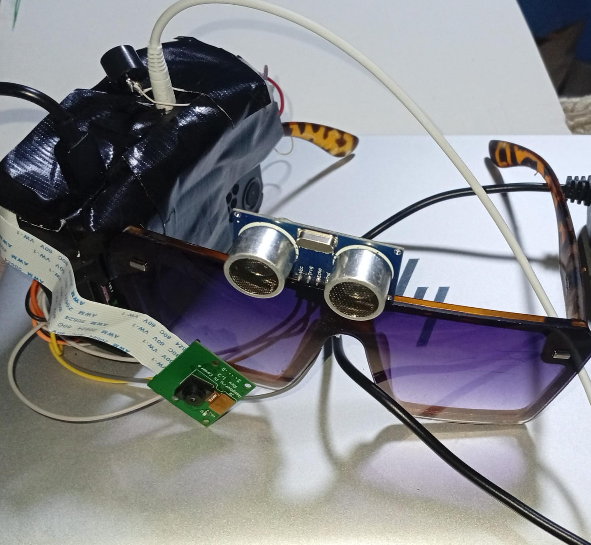

# 🕶️ Smart Glass — Lunette Intelligente de Détection d'Obstacles

> **Assister les personnes malvoyantes grâce à l'intelligence artificielle**


[](https://www.python.org/)
[](https://docs.ultralytics.com/)
[](https://www.raspberrypi.com/)
[](LICENSE)
[](https://www.ueuromed.org/)

---

## 📋 Table des Matières

- [À Propos](#-à-propos)
- [Problématique](#-problématique)
- [Objectifs](#-objectifs)
- [Démo](#-démo)
- [Architecture du Système](#-architecture-du-système)
- [Matériel Requis](#-matériel-requis)
- [Logiciels & Bibliothèques](#-logiciels--bibliothèques)
- [Schéma de Câblage](#-schéma-de-câblage)
- [Installation](#-installation)
- [Utilisation](#-utilisation)
- [Résultats](#-résultats)
- [Perspectives](#-perspectives)
- [Équipe](#-équipe)

---

## 🔍 À Propos

**Smart Glass** est une lunette intelligente embarquée conçue pour aider les personnes malvoyantes à naviguer en toute sécurité dans leur environnement. Le système combine un capteur ultrasonique, une caméra et un modèle d'IA pour détecter et identifier les obstacles en temps réel, puis en informer l'utilisateur par retour vocal.

> *"Voir le monde autrement grâce à la technologie."*

---

## ❓ Problématique

Des millions de personnes malvoyantes font face chaque jour au défi de détecter les obstacles dans leur environnement. Les solutions existantes sont souvent coûteuses, peu accessibles ou limitées en fonctionnalités. Ce projet propose une alternative **portable**, **autonome** et **abordable**, basée sur des composants open-source.

---

## 🎯 Objectifs

- ✅ Détecter les obstacles en temps réel jusqu'à **4 mètres**
- ✅ Identifier automatiquement les objets environnants grâce à **YOLO11n**
- ✅ Informer l'utilisateur via des **alertes vocales** en français (eSpeak)
- ✅ Déclencher un **signal sonore** (buzzer) dès qu'un obstacle est à < 100 cm
- ✅ Afficher les informations sur un **écran LCD 16×2**
- ✅ Fonctionner **sans connexion internet** (100% embarqué)

---

## 🎬 Démo

| Prototype | Soutenance |
|-----------|------------|
|  |  |

**Exemple de fonctionnement :**
```
📏 Distance : 67 cm
⚡ Objet proche → Analyse YOLO...
   Détections : ['person']
🔊 "personne detecte a 67 centimetres"
🚨 ALARME activée (2 secondes)
```

---

## 🏗️ Architecture du Système

```
┌─────────────────────────────────────────────────────┐
│                   SMART GLASS                        │
│                                                     │
│  [HC-SR04] ──► distance < 100cm ?                   │
│                      │ OUI                          │
│                      ▼                              │
│  [Picamera2] ──► capture RGB 640×480                │
│                      │                              │
│                      ▼                              │
│  [YOLO11n] ──► identification objet                 │
│                      │                              │
│          ┌───────────┼───────────┐                  │
│          ▼           ▼           ▼                  │
│       [eSpeak]    [Buzzer]    [LCD 16×2]            │
│       vocal       2 sec       affichage             │
└─────────────────────────────────────────────────────┘
```

**Flux de traitement :**

| Étape | Action |
|-------|--------|
| 1 | HC-SR04 mesure la distance toutes les **0,3 s** |
| 2 | Si distance < 100 cm → activation de **Picamera2** |
| 3 | Capture image RGB 640×480 → envoi à **YOLO11n** (imgsz=320) |
| 4 | YOLO11n identifie les objets présents |
| 5 | eSpeak annonce : **"[objet] détecté à [X] centimètres"** |
| 6 | Buzzer activé **2 secondes** via transistor 2N2222 |
| 7 | Pause **3 s** pour éviter la répétition des alertes |

---

## 🔧 Matériel Requis

| Composant | Rôle | Quantité |
|-----------|------|----------|
| Raspberry Pi 4 (4 Go RAM) | Unité centrale de traitement | 1 |
| Caméra Raspberry Pi | Acquisition des images | 1 |
| Capteur HC-SR04 | Mesure de distance par ultrasons | 1 |
| Buzzer passif | Alerte sonore de proximité | 1 |
| Transistor 2N2222 | Amplification du signal GPIO | 1 |
| Résistances (1 kΩ) | Protection des GPIO | 2 |
| Écran LCD 16×2 | Affichage des informations | 1 |
| Écouteurs (jack 3,5 mm) | Sortie audio eSpeak | 1 |
| Breadboard + fils dupont | Prototypage et câblage | — |
| Batterie externe | Alimentation portable | 1 |

---

## 💻 Logiciels & Bibliothèques

| Élément | Version | Description |
|---------|---------|-------------|
| Raspberry Pi OS | Debian aarch64 | Système d'exploitation |
| Python | 3.11 | Langage principal |
| Ultralytics YOLO11n | latest | Détection d'objets (modèle nano) |
| Picamera2 | latest | Interfaçage caméra Raspberry Pi |
| OpenCV | 4.x | Traitement d'images |
| RPi.GPIO | latest | Contrôle des broches GPIO |
| RPLCD | latest | Pilotage écran LCD 16×2 |
| eSpeak | latest | Synthèse vocale Text-to-Speech |
| PyTorch | 2.12 | Framework deep learning (piwheels) |

---

## 🔌 Schéma de Câblage

```
Raspberry Pi (BCM)      HC-SR04
──────────────────      ───────
5V              ──────► VCC
GPIO 23         ──────► TRIG
GPIO 24 ──[1kΩ]──────► ECHO
GND             ──────► GND

Raspberry Pi (BCM)      Transistor 2N2222      Buzzer
──────────────────      ─────────────────      ──────
GPIO 18 ──[1kΩ]──────► Base (B)
                        Collecteur (C) ───────► Pôle − (court)
                        Émetteur (E)   ──────── GND
5V                                    ───────► Pôle + (long)

Raspberry Pi (BCM)      LCD 16×2
──────────────────      ────────
GPIO 25         ──────► RS
GPIO 19         ──────► E (Enable)
GPIO 13         ──────► D4
GPIO 6          ──────► D5
GPIO 5          ──────► D6
GPIO 11         ──────► D7
5V              ──────► VDD + A (rétroéclairage)
GND             ──────► VSS + V0 + RW + K
```

---

## 🚀 Installation

### 1. Cloner le dépôt

```bash
git clone https://github.com/votre-username/smart-glass.git
cd smart-glass
```

### 2. Créer l'environnement virtuel

```bash
python3 -m venv ~/yolo/venv
source ~/yolo/venv/bin/activate
```

### 3. Installer les dépendances

```bash
# Bibliothèques principales
pip install -r requirements.txt

# PyTorch optimisé ARM (Raspberry Pi)
pip install torch --index-url https://www.piwheels.org/simple/

# eSpeak (système)
sudo apt install espeak

# Picamera2 (système)
sudo apt install python3-picamera2
```

### 4. Activer la caméra

```bash
sudo raspi-config
# → Interface Options → Camera → Enable
```

### 5. Télécharger le modèle YOLO11n

```bash
# Le modèle se télécharge automatiquement au premier lancement
# Ou manuellement :
mkdir -p models
wget -P models/ https://github.com/ultralytics/assets/releases/download/v8.3.0/yolo11n.pt
```

---

## ▶️ Utilisation

```bash
# Activer l'environnement virtuel
source ~/yolo/venv/bin/activate

# Lancer le système
sudo python3 projet_final.py
```

**Arrêt propre :** `Ctrl+C` — le LCD affiche "Au revoir !" et tous les GPIO sont libérés.

---

## 📊 Résultats

| Indicateur | Valeur |
|------------|--------|
| Portée HC-SR04 | jusqu'à **4 mètres** |
| Seuil d'alerte | **< 100 cm** |
| Résolution analyse YOLO | **320×320** px |
| Précision YOLO11n | **> 80%** sur objets courants |
| Temps de réponse | **< 300 ms** |
| Durée alarme buzzer | **2 secondes** |
| Autonomie (batterie externe) | **~3 heures** |

---

## 🔭 Perspectives

- 📍 Intégration d'un GPS et navigation vocale
- 👤 Ajout de la reconnaissance faciale pour identifier les proches
- 🔋 Amélioration de l'autonomie avec une batterie plus performante
- 📱 Déploiement d'une application mobile pour le suivi
- 📡 Support de plusieurs capteurs ultrasoniques (couverture angulaire élargie)
- 🚗 Modèle YOLO spécialisé piétons/véhicules

---

## 👥 Équipe

Projet réalisé dans le cadre du **Semestre 4 — Année Académique 2025/2026**  
**Université EUROMED de Fès (UEMF) — École d'Ingénierie Digitale et d'Intelligence Artificielle (EDIIA)**

| Membre | Rôle |
|--------|------|
| **Asmae Oussetta** | Développement & Intégration |
| **Nassima Moufidi** | Développement & Intégration |
| **Mouad Okham** | Hardware & Câblage |
| **Taoufiq Radoua** | Hardware & Câblage |

**Encadrants :** Dr. Taha Zoulagh · Dr. Ayadi Nouamane

---

## 📄 Licence

Ce projet est sous licence [MIT](LICENSE) — libre d'utilisation, de modification et de distribution.

---

<p align="center">
  <em>🕶️ Voir le monde autrement grâce à la technologie</em><br>
  <strong>UEMF · EDIIA · Groupe AMNT · 2025–2026</strong>
</p>
